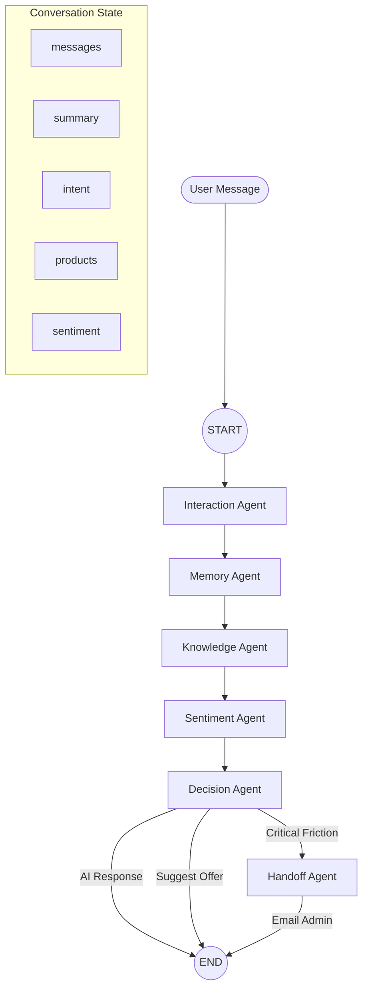

# 🤖 Chronos AI: Detailed Agent Workflow

This document provides a deep dive into the multi-agent architecture powering the Chronos AI Watch Store. Our system uses a sophisticated **LangGraph** workflow orchestrated by **Groq Llama 3.3 70B** to provide a seamless, conversational shopping experience.

---

## 🏗️ Architectural Overview

The AI backend is a specialized FastAPI service that communicates with the Next.js frontend via **Socket.IO**. The core logic resides in a **Directed Acyclic Graph (DAG)** where each node represents a specialized AI agent.

### Core Technologies:
- **Orchestration**: LangGraph (State machine for agents)
- **Intelligence**: Groq SDK (Llama 3.3 70B Versatile)
- **Real-time**: Socket.IO (Bidirectional event-based communication)
- **Context Persistence**: In-memory Session Manager (Redis-ready)

---

## 🔄 The LangGraph Workflow

The workflow follows a sequential pipeline where state is passed and enriched by each agent.

---

## 📦 State Management (`state.py`)

The `ConversationState` is a `TypedDict` that tracks the entire context of the user interaction as it moves through the graph.

| Field | Type | Description |
| :--- | :--- | :--- |
| `messages` | `List[Message]` | Full chat history (user & ai) |
| `session_id` | `str` | Unique ID for the chat session |
| `conversation_summary` | `str` | LLM-generated summary of past context |
| `user_intent` | `str` | Classified intent (e.g., `cart_management`) |
| `extracted_entities` | `Dict` | Extracted watch models, brands, prices |
| `sentiment_score` | `float` | User satisfaction score (-1.0 to 1.0) |
| `retrieved_products` | `List` | Products fetched from database |
| `route` | `str` | Routing decision (`ai_response`, `escalate`) |

---

## 🕵️ Agent Roles & Responsibilities

### 1. Interaction Agent (`interaction_agent.py`)
**Role**: The "Bouncer" and Router.
- **Goal**: Classify the user's intent to determine if we need a deep search or a simple chat.
- **Intents**: `product_inquiry`, `purchase`, `cart_management`, `order_tracking`, `pricing`, `general_chat`.
- **Logic**: If intent is search-related, it routes to `knowledge`. If it's small talk, it routes to `direct_response`.

### 2. Memory Agent (`memory_agent.py`)
**Role**: The "Historian".
- **Goal**: Maintain long-term context without hitting token limits.
- **Logic**: When history reaches >3 messages, it summarizes the conversation into a concise paragraph. This summary is injected into future agent prompts to ensure continuity.

### 3. Knowledge Agent (`knowledge_agent.py`)
**Role**: The "Sales Expert".
- **Goal**: Convert natural language into structured database queries.
- **Logic**:
    1. Extracts search params (`brand`, `maxPrice`, `features`) from user message + context.
    2. Calls `search_products_with_params` (Prisma-backed API).
    3. Formats the results into a context string for the response.
- **RAG Implementation**: It uses the search results as "Ground Truth" for the LLM to answer questions.

### 4. Sentiment Agent (`sentiment_agent.py`)
**Role**: The "Emotional Support".
- **Goal**: Detect frustration or escalation signals.
- **Logic**: Calculates a sentiment score. It flags `negative_sentiment` or `repeated_questions`. If a user is angry, it sets `escalation_signals`.

### 5. Decision Agent (`decision_agent.py`)
**Role**: The "Brain".
- **Goal**: Execute final actions and generate the final response.
- **Available Tools**:
    - `search_products`: Browse catalog.
    - `add_to_cart` / `update_cart_quantity`: Manage shopping bag.
    - `create_order`: Process purchase from cart.
    - `add_to_wishlist`: Save for later.
    - `escalate_to_human`: Hand over to admin for critical issues.
- **Execution Flow**: If a cart/order action is needed, it calls the `execute_nlp_action` endpoint on the Next.js server.

---

## 🛠️ Tool Execution & NLP Actions

The **Decision Agent** doesn't just talk; it acts. It communicates with the **Next.js API** via helper functions in `database_tools.py`.

### Example: "Add the Grand Complications to my cart"
1. **Decision Agent** identifies `add_to_cart` action.
2. It sends the user message to the `/api/actions/execute-nlp-action` endpoint.
3. **Next.js Side**:
   - LLM extracts: `{ "action": "add_to_cart", "watch": "Grand Complications" }`
   - **Fuzzy Match Engine**: Search DB for "Grand Complications".
   - **DB Update**: Upsert the item into the user's `CartItem` table.
   - **Response**: Return success message "Added to cart!".
4. AI Backend receives the result and confirms to the user.

---

## 🚨 Error Handling & Escalation

### Graceful Degradation:
- **LLM Failure**: If Groq is unavailable, the system falls back to a smaller model (Llama 8B) or returns a polite "Internal error" message.
- **JSON Parsing**: All agents have robust regex-based JSON extraction to handle LLM formatting quirks.
- **Session Recovery**: If a session is lost, the system starts fresh but tries to use the summary stored in the DB (if available).

### Human Handoff:
When the `Sentiment Agent` detects critical friction (e.g., "I'm calling my lawyer"), the `Decision Agent` triggers `escalate_to_human`.
1. **Route Change**: Graph routes to `handoff` node.
2. **Notification**: System triggers `send_escalation_email` to admin.
3. **User Feedback**: User is told their request has been prioritized for human review.

---

## 📊 End-to-End Trace Example

**User**: "I want a luxury watch under $50k from Patek Philippe"

1. **Interaction**: Intent `product_inquiry`.
2. **Memory**: "User is looking for luxury timepieces."
3. **Knowledge**:
   - Params: `{"brand": "Patek Philippe", "maxPrice": 50000, "intent": "luxury"}`
   - DB Query: `SELECT * FROM Watch WHERE price < 50000 AND brand = 'Patek Philippe'`
   - Results: Found 2 watches (Nautilus, Calatrava).
4. **Sentiment**: `0.8` (Positive/Excited).
5. **Decision**:
   - Action: `search_products`.
   - Response: "I found 2 exquisite Patek Philippe timepieces under $50,000. Here they are..."
6. **Frontend**: Socket.IO sends response + product metadata; ChatWidget renders product cards.

---
*Generated by Chronos AI Orchestration Engine*
