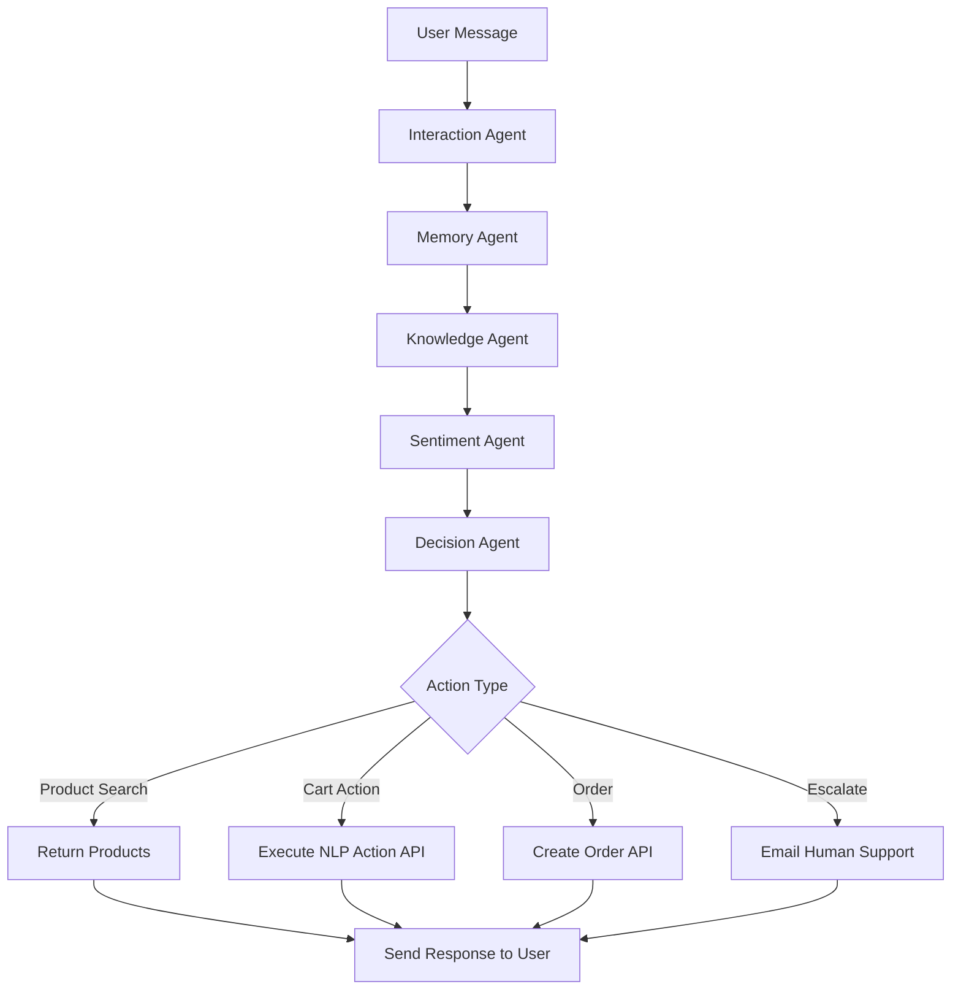

# Tech Stack & Workflow - Chronos AI Watch Store

## 🛠️ Technology Stack

### Frontend (Next.js)
- **Framework**: Next.js 16.1.6 with App Router
- **Language**: TypeScript
- **Styling**: Vanilla CSS with custom design system
- **State Management**: Zustand (for cart, wishlist)
- **UI Components**: Custom React components with Framer Motion animations
- **Real-time Communication**: Socket.IO Client
- **Authentication**: Custom JWT-based auth with session management

### Backend (Python AI)
- **Framework**: FastAPI + Uvicorn
- **Language**: Python 3.12
- **AI/LLM**: Groq SDK with Llama 3.3 70B Versatile
- **Orchestration**: LangGraph (multi-agent workflow)
- **Real-time**: Socket.IO Server
- **Vector Store**: In-memory FAISS (for product embeddings)
- **Session Management**: In-memory (Redis-ready)

### Database & ORM
- **Database**: PostgreSQL (via Prisma Accelerate)
- **ORM**: Prisma 6.19.2
- **Schema**: User, Watch, Brand, Category, CartItem, Wishlist, Order, OrderItem

### AI Agents (LangGraph Workflow)
1. **Interaction Agent**: Intent classification (product_inquiry, cart_management, purchase, etc.)
2. **Memory Agent**: Conversation summarization and context retention
3. **Knowledge Agent**: Product search using structured NLP-to-SQL queries
4. **Sentiment Agent**: User sentiment analysis and escalation detection
5. **Decision Agent**: Action routing and execution (add to cart, create order, etc.)

### APIs & Services
- **Groq API**: LLM inference for all AI agents
- **Prisma Accelerate**: Database connection pooling and caching
- **Next.js API Routes**: RESTful endpoints for cart, wishlist, orders, products

> [!NOTE]
> For a deep dive into the agent logic, state management, and tool execution, see the [Detailed Agent Workflow](file:///home/dhashu/Downloads/project1/AGENT_WORKFLOW.md).

---

## 🔄 End-to-End Workflow

### 1. User Interaction Flow

```
User Message → Socket.IO → AI Backend → LangGraph Workflow → Response
```

#### Step-by-Step:
1. **User sends message** via ChatWidget component
2. **Socket.IO emits** `send_message` event to Python backend
3. **Backend receives** message and starts LangGraph workflow

### 2. LangGraph Multi-Agent Workflow



#### Agent Responsibilities:

**Interaction Agent**
- Classifies user intent (product_inquiry, cart_management, purchase, etc.)
- Extracts initial context

**Memory Agent**
- Summarizes conversation history
- Maintains context across messages

**Knowledge Agent**
- Converts NLP queries to structured Prisma queries
- Calls `/api/products/search-structured` with intent parameters
- Returns relevant products

**Sentiment Agent**
- Analyzes user sentiment (-1.0 to 1.0)
- Detects frustration, urgency, satisfaction
- Flags for escalation if needed

**Decision Agent**
- Decides final action based on all agent outputs
- Routes to appropriate tool:
  - `search_products`: Display products
  - `add_to_cart`: Call NLP action endpoint
  - `create_order`: Process purchase
  - `get_orders`: Fetch order history
  - `direct_response`: Answer questions using context

### 3. NLP Action Execution (Cart/Wishlist/Order)

When user says: **"add Grand Complications to my cart"**

```
Decision Agent → execute_nlp_action() → /api/actions/execute-nlp-action
```

**NLP Action Endpoint Flow:**
1. **LLM extracts action** from user message:
   ```json
   {
     "action": "add_to_cart",
     "watchReference": "Grand Complications",
     "quantity": 1
   }
   ```

2. **Watch Resolution** (multi-tier matching):
   - Try exact match: `name = "Grand Complications"`
   - Try case-insensitive exact: `name ILIKE "Grand Complications"`
   - Try starts with: `name ILIKE "Grand%"`
   - Last resort: partial match if term ≥ 5 chars

3. **Execute Action**:
   - `add_to_cart` → Upsert CartItem in database
   - `add_to_wishlist` → Upsert Wishlist in database
   - `create_order` → Create Order + OrderItems, clear cart

4. **Return Success Message**:
   ```json
   {
     "success": true,
     "message": "Added Grand Complications by Patek Philippe to your cart"
   }
   ```

### 4. Product Search Flow

When user asks: **"show me the most expensive watch"**

```
Knowledge Agent → /api/products/search-structured → Groq LLM → Prisma Query
```

**Search-Structured API Flow:**
1. **Extract intent parameters**:
   ```json
   {
     "intent": "luxury",
     "query": "most expensive watch"
   }
   ```

2. **LLM generates Prisma query**:
   ```json
   {
     "where": {
       "AND": [
         {"price": {"gte": 5000}},
         {"stock": {"gt": 0}}
       ]
     },
     "orderBy": {"price": "desc"}
   }
   ```

3. **Execute query** and return products

4. **Decision Agent formats response**:
   - "I found 10 timepieces matching your request."
   - Displays product cards with images, prices, brands

### 5. Order Creation Flow

When user says: **"buy my cart"**

```
Decision Agent → create_order_from_cart() → /api/actions/execute-nlp-action
```

**Order Creation Steps:**
1. Fetch user's cart items
2. Validate stock availability
3. Calculate total price
4. Create Order record
5. Create OrderItem records for each cart item
6. Clear cart
7. Return confirmation with order details

### 6. Authentication Flow

```
Login → /api/auth/login → Verify password → Generate JWT → Set cookie
```

**Session Management:**
- JWT stored in HTTP-only cookie
- `getSession()` validates token on each request
- Backend uses `X-Backend-Service-Key` for internal API calls

---

## 📁 Project Structure

```
project1/
├── app/                          # Next.js App Router
│   ├── api/                      # API Routes
│   │   ├── actions/
│   │   │   └── execute-nlp-action/  # NLP action processor
│   │   ├── cart/                 # Cart CRUD
│   │   ├── wishlist/             # Wishlist CRUD
│   │   ├── orders/               # Order management
│   │   ├── products/
│   │   │   └── search-structured/   # AI-powered search
│   │   └── auth/                 # Authentication
│   ├── (pages)/                  # App pages
│   └── layout.tsx
├── components/                   # React components
│   ├── chat/                     # ChatWidget, MessageList
│   ├── product/                  # Product cards
│   └── ui/                       # Reusable UI components
├── lib/                          # Utilities
│   ├── prisma.ts                 # Prisma client
│   ├── auth.ts                   # JWT auth helpers
│   └── socket.ts                 # Socket.IO client
├── store/                        # Zustand stores
│   ├── useCartStore.ts
│   └── useWishlistStore.ts
├── ai-backend/                   # Python AI Backend
│   ├── agents/                   # LangGraph agents
│   │   ├── interaction_agent.py
│   │   ├── memory_agent.py
│   │   ├── knowledge_agent.py
│   │   ├── sentiment_agent.py
│   │   └── decision_agent.py
│   ├── tools/                    # Agent tools
│   │   ├── database_tools.py     # API call helpers
│   │   └── email_tools.py
│   ├── workflow/                 # LangGraph workflow
│   │   ├── graph.py              # Workflow definition
│   │   └── state.py              # State schema
│   ├── utils/
│   │   ├── vector_store.py       # FAISS vector store
│   │   └── session_manager.py
│   └── main.py                   # FastAPI + Socket.IO server
└── prisma/
    ├── schema.prisma             # Database schema
    └── seed.ts                   # Seed data
```

---

## 🔐 Environment Variables

```bash
# Database
DATABASE_URL="prisma+postgres://..."

# AI
GROQ_API_KEY="gsk_..."

# Backend
NEXT_PUBLIC_AI_BACKEND_URL="http://127.0.0.1:8000"
BACKEND_SERVICE_KEY="chronos-secret-service-key-123"

# Auth
JWT_SECRET="your-super-secret-jwt-key"
NEXTAUTH_SECRET="complex_secret_value"
```

---

## 🚀 Running the Project

### 1. Start Next.js Frontend
```bash
npm run dev
# Runs on http://localhost:3000
```

### 2. Start Python AI Backend
```bash
cd ai-backend
python3 main.py
# Runs on http://127.0.0.1:8000
```

### 3. Database Setup
```bash
npx prisma generate
npx prisma db push
npx prisma db seed
```

---

## 🎯 Key Features Implemented

✅ **AI-Powered Product Search**: NLP-to-SQL query generation  
✅ **Smart Cart Management**: Natural language cart operations  
✅ **Order Processing**: Direct purchase from cart or wishlist  
✅ **Multi-Agent AI**: 5 specialized agents working in sequence  
✅ **Real-time Chat**: Socket.IO for instant responses  
✅ **Sentiment Analysis**: Detects user frustration and escalates  
✅ **Watch Name Matching**: Multi-tier fuzzy matching (exact → partial)  
✅ **User Context Awareness**: AI knows cart/wishlist contents  
✅ **Order History**: View past purchases  
✅ **Wishlist Actions**: Add, clear, move to cart, buy directly  

---

## 🔧 Recent Fixes

1. **Search API**: Fixed LLM generating invalid `categoryId` queries
2. **Watch Matching**: Prioritized exact matches over fuzzy search
3. **Cart Queries**: Updated Decision Agent to use `direct_response` for "what's in my cart?"
4. **Error Logging**: Added debug logs to wishlist functions

---

## 📊 Data Flow Example

**User**: "Add the most expensive Patek Philippe to my cart"

1. **Socket.IO** → Backend receives message
2. **Interaction Agent** → Intent: `cart_management`
3. **Memory Agent** → Summarizes context
4. **Knowledge Agent** → Searches for "most expensive Patek Philippe"
   - Calls `/api/products/search-structured`
   - LLM generates: `{brand: "Patek Philippe", orderBy: {price: "desc"}}`
   - Returns: Grand Complications ($125,000)
5. **Sentiment Agent** → Neutral sentiment
6. **Decision Agent** → Action: `add_to_cart`
   - Calls `execute_nlp_action` with user message
   - NLP endpoint extracts: `{action: "add_to_cart", watchReference: "Grand Complications"}`
   - Matches watch by exact name
   - Upserts CartItem in database
7. **Response** → "Added Grand Complications by Patek Philippe to your cart"

---

## 🎨 Design Philosophy

- **Conversational Commerce**: Users shop by chatting naturally
- **Context-Aware**: AI remembers cart, wishlist, and conversation history
- **Autonomous Actions**: AI can execute complex multi-step operations
- **Graceful Degradation**: Fallbacks for LLM failures or rate limits
- **Premium UX**: Smooth animations, real-time updates, rich product cards
